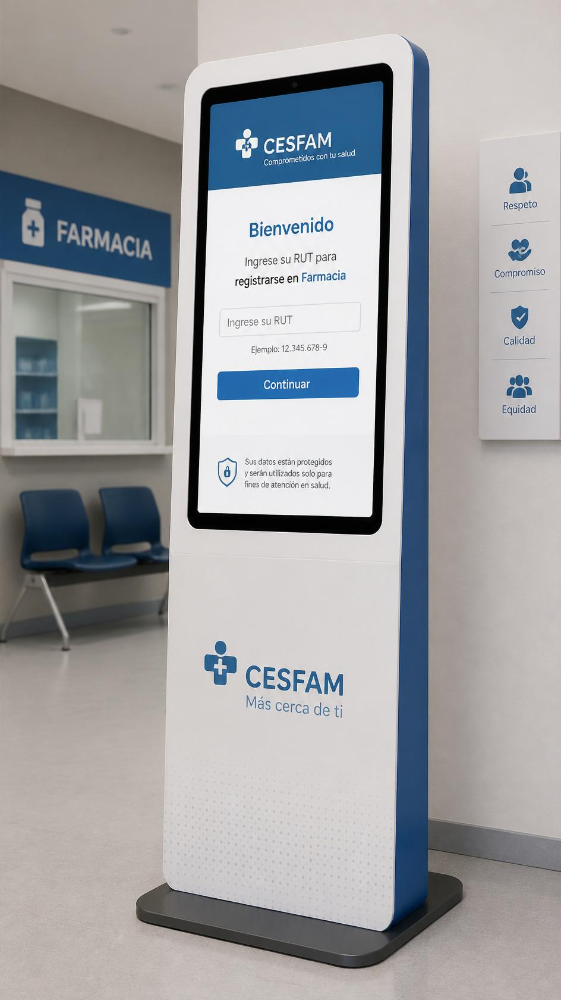

# Tótem CESFAM 

Sistema de gestión de turnos para la recepción de farmacia de un CESFAM, compuesto por un tótem de autoatención, una pantalla de sala con anuncios por voz y un panel para el funcionario de farmacia.



## Problemática

El tótem actual de la farmacia presenta problemas de usabilidad:

- Tras ingresar el RUT, pregunta al paciente si su atención es preferencial o general, decisión que el sistema debería tomar automáticamente consultando la ficha del paciente (edad, embarazo, discapacidad registrada).
- La interfaz no es intuitiva para adultos mayores, el principal público de la farmacia.

## Solución

| Vista | Ruta | Descripción |
|---|---|---|
| **Tótem** | `/` | Ingreso de RUT → (si es apoderado, pregunta para quién es la atención) → clasificación automática (general/preferencial) → ticket con nombre y número. |
| **Pantalla de sala** | `/sala` | Cola en tiempo real, anuncio por voz (Web Speech API) y últimos llamados. |
| **Panel del funcionario** | `/panel` | Selecciona casilla, llama al siguiente, re-llama, marca no presentado o finaliza. |

La clasificación general/preferencial depende del **ticket**, no de la casilla: una misma ventanilla puede atender pacientes de ambos tipos, y el anuncio de voz siempre dice el tipo real del paciente llamado.

### Apoderados

Un paciente puede estar registrado como **apoderado** de uno o más dependientes (por ejemplo, personas en situación de discapacidad a su cargo). Es una relación N:M: un apoderado puede tener varios dependientes y un dependiente puede tener varios apoderados.

Cuando el RUT ingresado en el tótem corresponde a un apoderado, antes de emitir el ticket se pregunta **"¿Para quién es la atención?"** (para el propio apoderado o para uno de sus dependientes). La clasificación preferencial/general se calcula sobre el **paciente real** de la atención, no sobre quien ingresa el RUT.

El vínculo apoderado→dependiente aplica cuando el dependiente tiene una discapacidad registrada (marcada en su ficha como preferencial). Los adultos mayores (60+) ya se clasifican solos como preferencial por edad; los menores de edad **no** son preferenciales por edad, solo lo son si tienen la marca de preferencial en su ficha.

## Arquitectura

```
React (3 vistas) ⇄ REST + Socket.IO ⇄ Express ⇄ Sequelize ⇄ PostgreSQL
```

- El backend crea/sincroniza las tablas automáticamente al levantar (`sequelize.sync()`), sin migraciones manuales.
- Cada transición de un ticket (`creado`, `llamado`, `actualizado`) se emite por Socket.IO para que la pantalla de sala y el panel reaccionen sin hacer polling.

## Stack

PostgreSQL · Express 5 · Sequelize · Socket.IO · React 19 · React Router · Vite

## Estructura del repo

```
totem_cesfam/
├── server/
│   ├── db/              # conexión a Postgres y scripts de datos de prueba
│   ├── src/
│   │   ├── entities/    # modelos Sequelize (Paciente, Casilla, Ticket, VinculoApoderado)
│   │   ├── routes/      # endpoints REST
│   │   ├── lib/         # clasificación por edad, fecha, etc.
│   │   ├── socket.js    # servidor de Socket.IO
│   │   └── index.js     # punto de entrada
│   └── package.json
└── client/
    ├── src/
    │   ├── pages/        # Totem, PantallaSala, PanelFuncionario
    │   ├── components/   # Encabezado
    │   ├── lib/          # helpers de RUT, título de pestaña
    │   ├── api.js         # cliente REST
    │   └── socket.js      # cliente Socket.IO
    └── package.json
```

## Cómo levantarlo

### Backend

```bash
cd server
npm install
cp .env.example .env   # completa con tus credenciales de Postgres
npm run dev             # o npm start
```

Al arrancar crea las tablas en la base indicada por `.env` y siembra las 3 casillas iniciales si no existen. El servidor queda en `http://localhost:3000`.

Datos de prueba (opcional):

```bash
node db/seed.js   # inserta 36 pacientes (30 base + 6 en 3 casos de apoderado/dependiente) para probar la pregunta "¿para quién es?"
```

### Frontend

```bash
cd client
npm install
npm run dev
```

Queda en `http://localhost:5173`. Abre `/`, `/sala` y `/panel` en pestañas distintas para simular el tótem, la sala y el puesto del funcionario.

## API

| Método | Ruta | Descripción |
|---|---|---|
| `GET` | `/api/pacientes/:rut` | Busca un paciente por RUT (tolera con o sin puntos/guion) e incluye sus `Dependientes` si es apoderado. |
| `POST` | `/api/pacientes` | Registra un paciente. |
| `GET` | `/api/casillas` | Lista las casillas activas. |
| `GET` | `/api/tickets` | Cola del día (`?estado=` para filtrar). |
| `POST` | `/api/tickets` | Emite un ticket para un RUT, clasificando automáticamente. Acepta `pacienteId` opcional para emitirlo a nombre de un dependiente del apoderado (se valida el vínculo). |
| `PATCH` | `/api/tickets/:id/llamar` | Asigna casilla y llama al paciente. |
| `PATCH` | `/api/tickets/:id/re-llamar` | Repite el anuncio sin cambiar el estado. |
| `PATCH` | `/api/tickets/:id/no-presentado` | Marca que el paciente no se presentó. |
| `PATCH` | `/api/tickets/:id/finalizar` | Cierra la atención. |

### Eventos de Socket.IO

`ticket:creado` · `ticket:llamado` · `ticket:actualizado`
